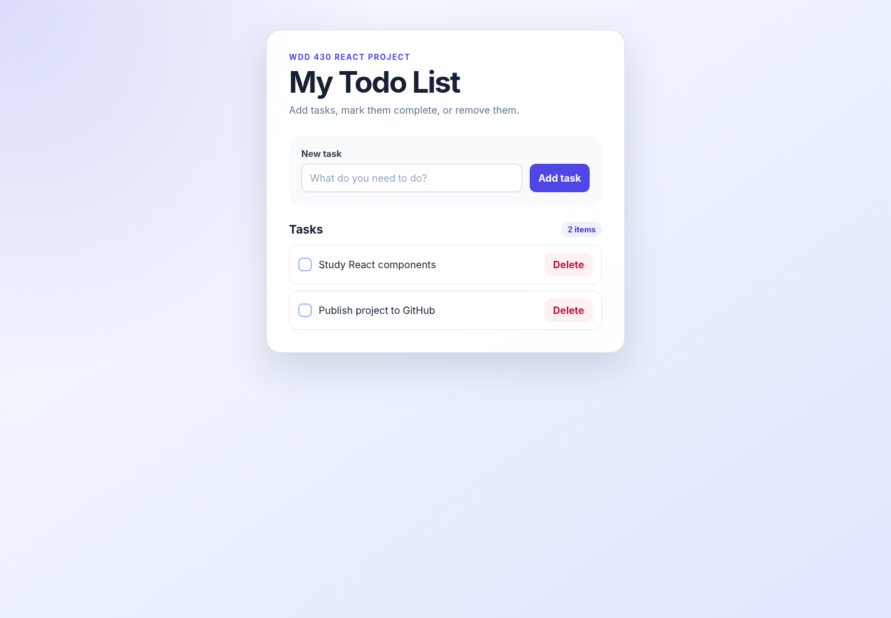

# React Todo List

A simple todo list application created with React and Vite for the WDD 430 course.

## Features

- Add new tasks
- Mark tasks as completed
- Delete tasks
- Save tasks in the browser with localStorage
- Responsive layout for desktop and mobile screens

## Technologies

- React
- JavaScript
- CSS
- Vite

## Run the project locally

```bash
npm install
npm run dev
```

Open the local address displayed in the terminal.

## Build the project

```bash
npm run build
```

## Project structure

```text
src/
├── App.jsx
├── NewTodoForm.jsx
├── TodoItem.jsx
├── TodoList.jsx
├── main.jsx
└── styles.css
```

## Screenshot



## Publish to GitHub

Create an empty public repository named `react-todo-list` on GitHub. Then run:

```bash
git remote add origin https://github.com/YOUR-USERNAME/react-todo-list.git
git push -u origin main
```

This project was created while following the Web Dev Simplified React todo list tutorial.
